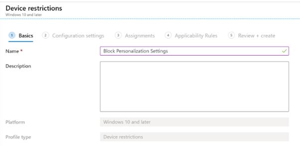
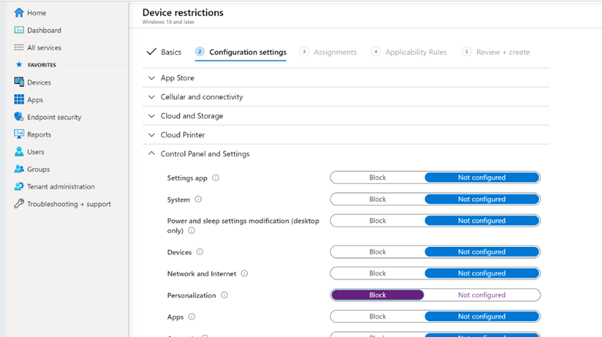
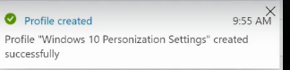

# Device-Configuration-Profile-with-Intune
Create a Configuration Profile. Block Personalization. Include Sales. Exclude Marketing.


<h2>Description</h2>
Project consists of a creating a Device Configuration Profile with Intune as a part of Mobile Device Management. Microsoft Intune includes settings and features you can enable or disable on different devices within your organization. These settings and features are added to "configuration profiles". You can create profiles for different devices and different platforms, including iOS/iPadOS, Android device administrator, Android Enterprise, and Windows. Then, use Intune to apply or "assign" the profile to the devices. As part of this project we will Block Personalization Sales group and exclude Marketing group.

<br />


<h2>Environments Used </h2>

- <b>Microsoft Endpoint Manager Admin Center Portal</b> 

<h2>Prerequisites</h2>

-<b> Configuration Profile can be created or modified by anyone assigned the following roles:
 - Intune administrator
 - Global Administrator
 </b>
- <b> Licenses:  EMS E3/E5 or Microsoft 365 F1/F3/E3/E5 license</b>

<h2>Program walk-through:</h2>

<h3>Steps: </h3>

1.  Go to MS Endpoint manager admin center
2.  Go to Devices --> select Configuration profiles --> Create profile
3.  Select ‘windows 10 and later’ platform and ‘Device restrictions’ profile
4.  Create --> give name 
5.  Configuration settings --> Control panel Settings --> Block Personalization
6.  Assignments section --> include Sales group and exclude Marketing group
7.  Next --> review + create
	
  <h3>Screenshots:</h3>

<p align="center">
Create Configuration Profile <br/>

<br />
<br />
Give Name: <br/>

<br />
<br />
Configuration Settings: <br/>

<br />
<br />
Review & Create: <br/>

<br />
<br />
Result: <br/>

<br />
<br />

</p>

<!--
 ```diff
- text in red
+ text in green
! text in orange
# text in gray
@@ text in purple (and bold)@@
```
--!>
